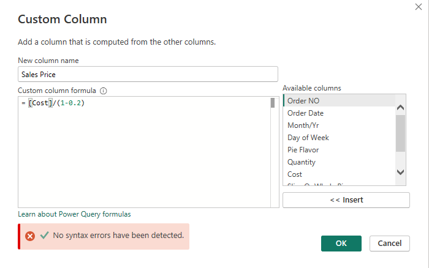
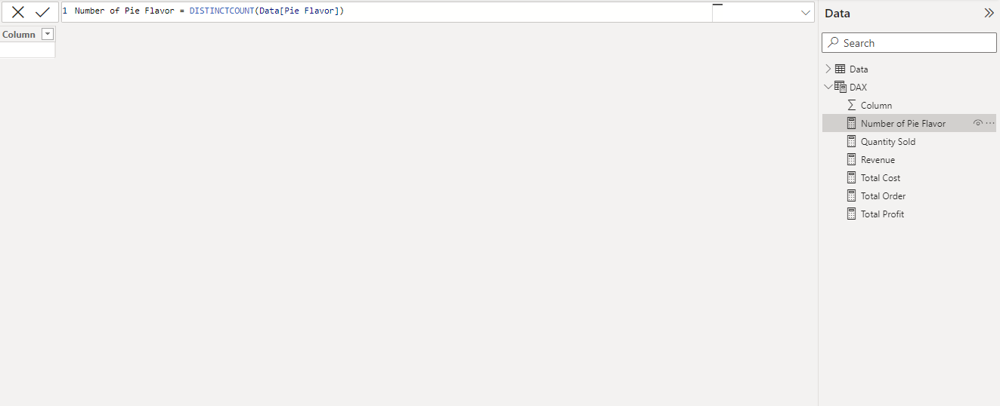
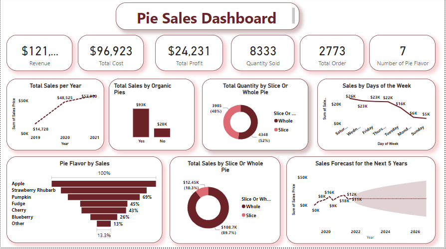

# Pie-Sales-Analysis
This is an analysis on pies sold within 3 years. This organization sells pie and makes it in 7 different pie flavor, sold in slice or whole. The sales takes two form. It is either sold in store or through pre-order purchase. The image below is gotten from [freepiks](https://www.freepik.com/free-photo/pastry-buffet_1239138.htm#query=meat%20pie%20sales&position=8&from_view=search&track=ais&uuid=c730eaa8-333f-427c-9be2-27027af735e9)

## Introduction
This dashboard presents the analysis of pies sold within 3 years. This organization sells pie and makes it in 7 different pie flavor, sold in slice or whole. The sales takes two form. It is either sold in store or through pre-order purchase. This analysis is done on Power BI.

## Problem Statement
The following questions are the recommended analysis
* What is the total pie sales for each year?
* Which pie flavor had the highest sales?
* Analyze the pie sales by whole or slice pie
* Are there significant increase in sales because of organic pies
* Predict sales for the next 5 years
* What days of the week had the highest pie sales?

## Data Source
The data used for this analysis was provided by Dahel Techies and Consultants during my internship program

## Skills and Concepts Demonstrated
The following are skills and concepts demonstrated when working on this project
* Transforming and cleaning data using Power Query Editor
* Creating columns for calculations of sales and profit
* Developing general DAX calculations
* Designing dashboard for a cohesive view of key performance indicators
* Data visualization

## Data Transformation
Changed all fields to the appropriate data types
Created new columns to calculate sales and profit as the data did not provide this information. The sales column was calculated using 20% of cost price

* Creating Sales Column
* 

## Data Analysis
Created DAX functions for aggregation and simple calculations

*DAX

## Data Visualization
This dashboard addressed the recommended analysis, generated lots of insights and highlights periods to increase sales

* Dashboard
* 
